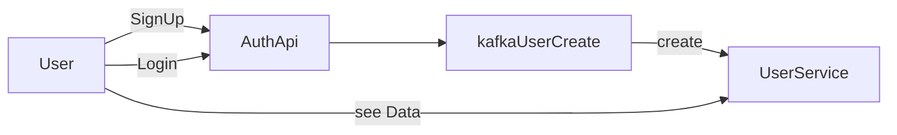

# rust-playground

This is a playground for all things rust, testing out different frameworks and trying to piece together a mini fullstack
system, using rust microservices and a frontend writen in rust compiled to wasm (WebAssembly).

## How to get started:

2. Install rust, find the appropiate install way dependend on your system, windows proberly rustup-init.exe, mac:
   MacPorts or Homebrew.
    1. https://doc.rust-lang.org/cargo/getting-started/installation.html
    2. https://forge.rust-lang.org/infra/other-installation-methods.html
3. in the setup.sh script you can see a number of plugins i use:
    1. cargo install geckodriver
    2. cargo install cargo-make
    3. cargo install wasm-pack --no-default-features
    4. cargo install cargo-generate
    5. cargo install diesel_cli --no-default-features
    6. npm install -g chromedriver
4. Clone https://github.com/Nierhoff/rust-playground
5. Build the project:
    1. cargo make myci
    2. cargo make dockerci
6. run it in Docker compose
    1. If you dont have docker installed: you can use, https://docs.rancherdesktop.io/getting-started/installation/
    2. cd docker-compose/
    3. docker compose -f docker-compose-project.yml up --build

## Tasks:

1. Signup screen
    1. Create a user signup API
2. Login screen
    1. Create a login security API
3. User screen (only for authenticated users)
    1. show all users
4. User creation process
    1. Involving kafka and postgress
5. Application logging
6. Application Health checks
    1. Create health api /health
7. Schema first approach
    1. Convert json schemas to Rust models
8. Swagger

## App Design

## List of inspiration:

If you are finding usefull links or finding good code examples this please paste them in below :)

1. https://doc.rust-lang.org/rust-by-example/testing/unit_testing.html
2. https://blog.logrocket.com/guide-mocking-rust-mockall/#methods-of-mocking-in-rust
3. https://github.com/GoogleContainerTools/distroless/blob/main/examples/rust/Dockerfile
4. https://docs.rs/kafka/latest/kafka/consumer/index.html
5. https://docs.rs/kafka/latest/kafka/producer/index.html
6. https://kerkour.com/web-application-with-rust-and-webassembly
7. https://github.com/skerkour/black-hat-rust/tree/main/ch_09/phishing

